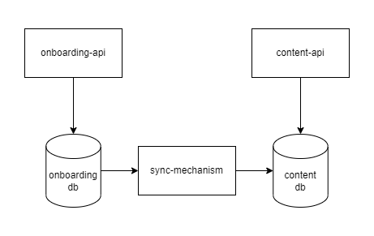
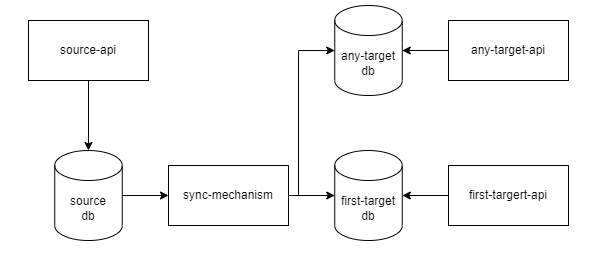
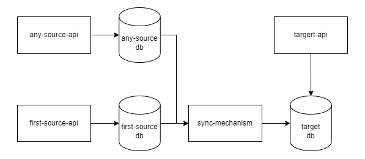
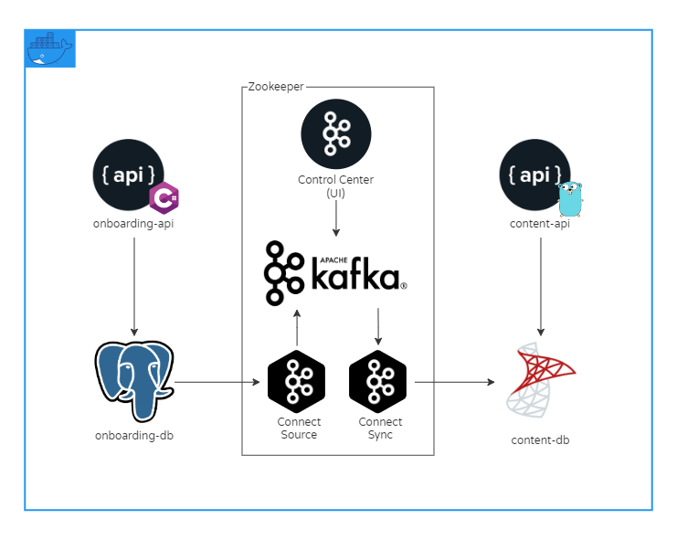

## Change Data Capture (CDC) and Heterogeneous Sync With Kafka Connect

## Give a Star! :star:

If you liked my work and want to support me, please give it a star. Thanks!

## 1. Introduction :thought_balloon:

It seems very logical for us, in the **Microservice Era**, **to define boundaries for each business context, with minimal or none data overlapping, and to isolate the services via APIs**. And don't get me wrong, this works very well most of the time, but at some point you will need to address some challenges in the strategy.

This repository is a sandbox implementation of **Change Data Capture (CDC)** and **Heterogeneous Data Sync** patterns using **Kafka Connect** to address some of the mentioned challenges.

## 2. The Core APIs Problem :warning:

In your architecture, the C**ore APIs are the services that many other services depend on**. They tend to start small, but they grows really fast and silent, until we notice them. And they bring with then a lot of problems.

### Microservices Resilience And Isolation

With the **tight coupling between your architecture components and the Core APIs**, with most of process depending upon the Core APIs endpoints, when the Core APIs are down, many process of the other services will be impacted, breaking the Microservices isolation and resilience idea.  

### Road Tripping

In your architecture, some of the **screens**, **reports**, or other business tasks, may depend upon data that relies on multiples boundaries. This business needs may not even exist at start, but things change, and this will probably became a business need. When this occur, it will sounds valid **a service needing to make calls to many others to retrieve all the data it needs to execute the task**. But this introduces a lot of complexity, costs, and dependencies too.

## 3. Synchronization Hell :fire:

At this point, it's clear that, to avoid the **Core APIs Problem**, we need some mechanism to, on demand, distribute and sync the data between the boundaries. Soo, it seems to be a good idea to change our services to send messages to a topic after data changes and develop a lot of **Sync Services** that will listen to this topics and update the data. 

**Some of the problems with this idea are:**
1. How much time will each team need to update their services and to develop this Sync Services we will need?
2. How much time will we need to develop complex **dead-letter**, **retries** and **rehydration policies**?
3. How much time will we need spent in bug fixes, payload versioning and contract tests, integrations, and more?
4. How to manage all the infra needed to do this?

## 4. An Event-Driven Managed Sync Solution :arrows_clockwise:
The idea of **distribute and sync data between services boundaries** seems to be a possible solution to avoid the **Core APIs** problem. But instead of developing the synchronization mechanism, maybe we can **reduce the tradeoffs using a managed solution**.

### Change Data Capture - CDC

**Change Data Capture (CDC)** refers to the process of identifying and capturing changes made in a data source and then delivering those changes in real-time to a downstream process or system. With CDC we can avoid changing the services to send messages to a topic after updating data and the complexity of implementing patterns like **unit of work** and **sagas**. CDC also helps us to avoid **dual write**, a common problem in **event-driven systems**.

### Kafka Connect

Kafka Connect is a tool for scalable and reliably streaming data from external system to Kafka and from Kafka to external systems. Kafka Connect makes simple and easy define connectors for many provides like **MSSQL**, **Postgres**, **AWS S3**, **ElasticSearch** and more. It stream data from source to Kafka via CDC, and from Kafka to sinks for data sync. Also Kafka Connect supports all Kafka infrastructure resources like **Apache Avro for schema management**, **Kafka durability guarantees and scalability**, and more.

With Kafka Connect and some minimal configuration, with can avoid the need to develop the Sync Services in addition to data transformation and filtering capabilities, heterogeneous sync between different data sources, and implement complex resiliency policy patterns with less effort.

## 5. Use Case :blue_book:

For this sandbox, the idea is to implement **two simple APIs**, **each with its database** and a **sync mechanism**. The first is the `onboarding-api` on which we can do CRUD operations on the author entity. The second is the `content-api` that will hold article data (for simplicity's sake, at this time, I've don't implemented the article CRUD) and some author's data. For the `content-api` uses cases we will need the **author id and name**. 

To avoid always to call the `onboarding-api` from the `content-api` we will need to sync this author data into the `content-api` database. Again, for simplicity's sake, its expected that the author data inside the `content-api` database is for **readonly**, otherwise the example would need two-way sync.



## 6. Evolutionary Architecture :page_facing_up:

In this example, the sync is between one source and one target, but we can evolute this architecture to support multiple targets and sources.

### With Many Targets


### With Many Sources


## 7. Implementation Details :computer:

As the nature of the sandbox concept, and for experimentation's sake, **I've decided to mix up some technologies**. 

The `onboarding-api` tech stack is an **ASP.NET Core API** with a **PostgreSQL** database, and the `content-api` is a **Go API** with **Gin** with a **SQL Server Database**. **Both databases start with database and tables creation**, the **PostgreSQL** via **SQL script**, and the **SQL Server**, due to its nature, is created via **Dockerfile** to execute the **SQL script** after creation. Both APIs are documented using **swagger**.

For sync implementation, I'm using **Kafka-Connect** with some startup configuration via **shell scripts** and **connector configuration using** **PostgresConnector with debezium for the source** and **JdbcSinkConnector for the target**.

As a dependency from **Kafka Connector**, I'm using a **Kafka broker** with a **Zookeeper control**. **For Kafka UI management I'm using Kafka Control Center**.

All components are containerized using **Docker** and run using **Docker Compose**.



## 8. How to Run :rocket:

### Components
```
docker-compose up -d
```
### Swagger

#### onboarding-api
```
http://localhost:5000/swagger
```

#### content-api
```
http://localhost:3000/swagger.html
```

### Control Center
```
http://localhost:9021
```

** Please wait until Kafka cluster Control Center be showed as healthy 